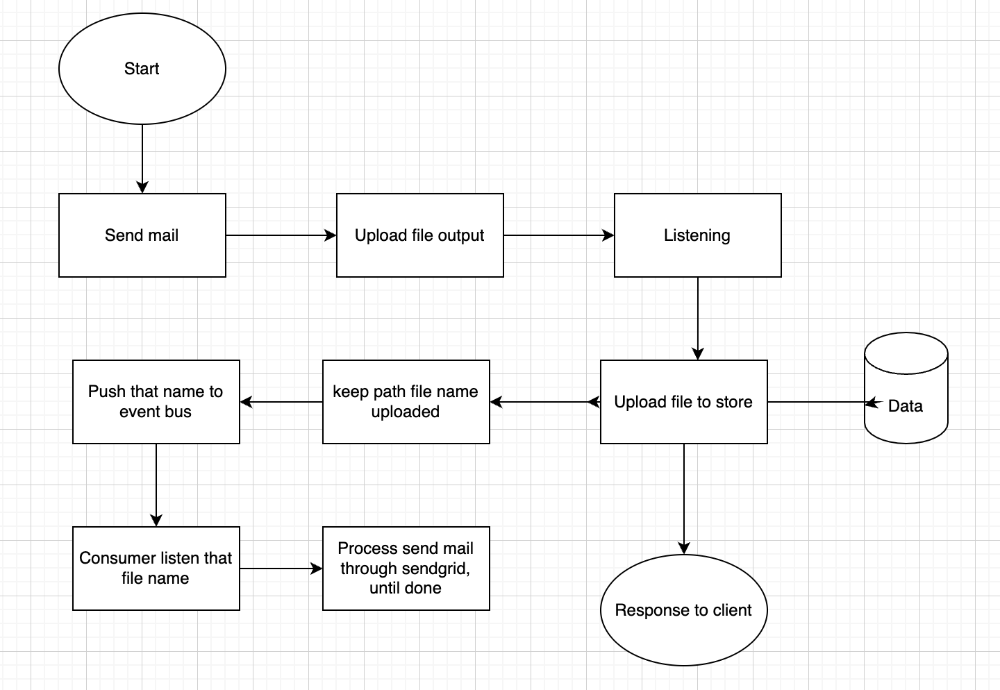
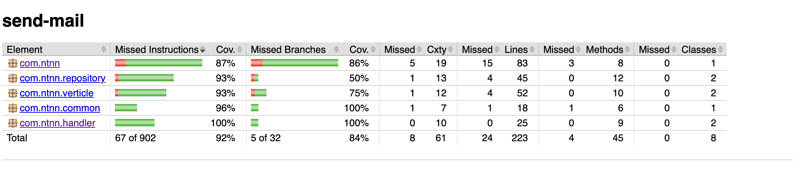
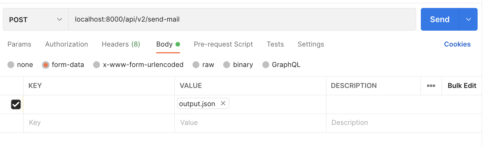

### ABOUT THIS SERVICE
Resolving problems of EmailTemplate also scaling the service when integrating SMTP and REST.

### INTRODUCTION ABOUT SEND-MAIL SERVICE

Technologies used in this project are: Java11, Vertx, JUnit, JUnit5 for testing integration.

Design pattern using in this project is Strategy.

The flows of rest api send mail:

After mapping between email template and customer.cvs data, we can use ouput.json for doing send-mail.
We will upload the file output.json then my service to storage that file then using event bus to push data received from client (Event Bus included consumer and publisher, using ram to storage message from sender). 
After that, at the side consumer, it will process continue to send mail to user who mapped with email template.



### HOW TO RUN MY SERVICE
run test case:

``` ./gradlew clean test ```

run in console with mode mapping:

``` ./gradlew cmdLineJavaExec -Pargs="{{pathEmailTemplate}} {{pathDataInput}} {{pathDataOutPut}} {{pathSaveDataError}}"```

run in console with mode using rest api to process:

``` ./gradlew cmdLineJavaExec -Pargs="" ```

watch test case coverage after running:

GoTo: ```build > reports > jacoco > index.html```



### HOW TO TEST REST API AT POSTMAIN

Configuration like this to test it:



